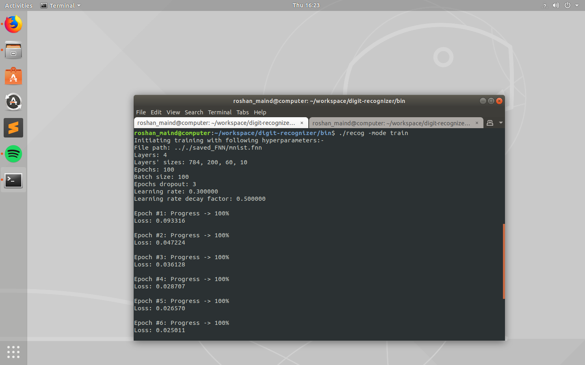
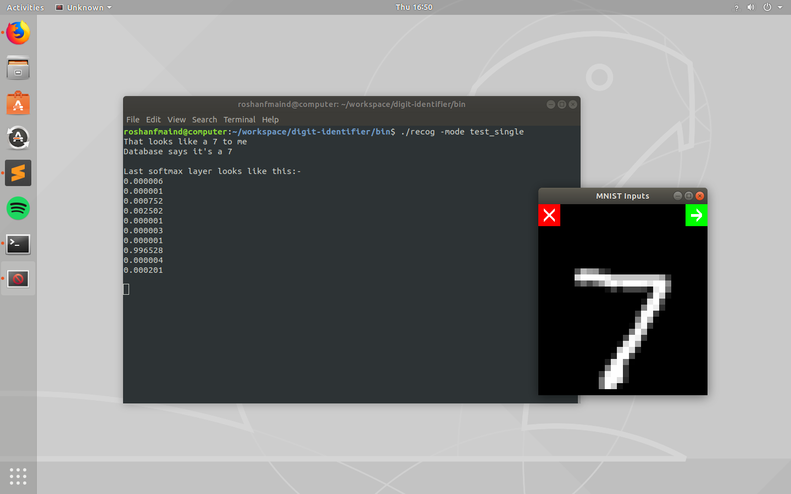
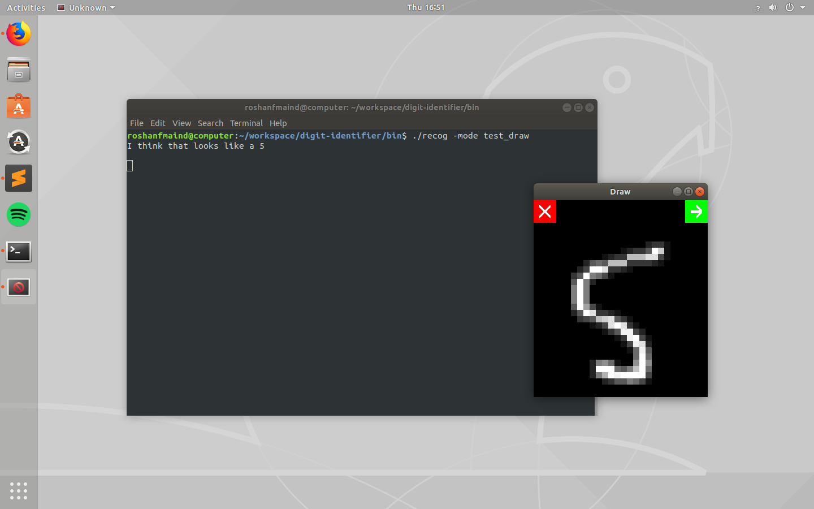
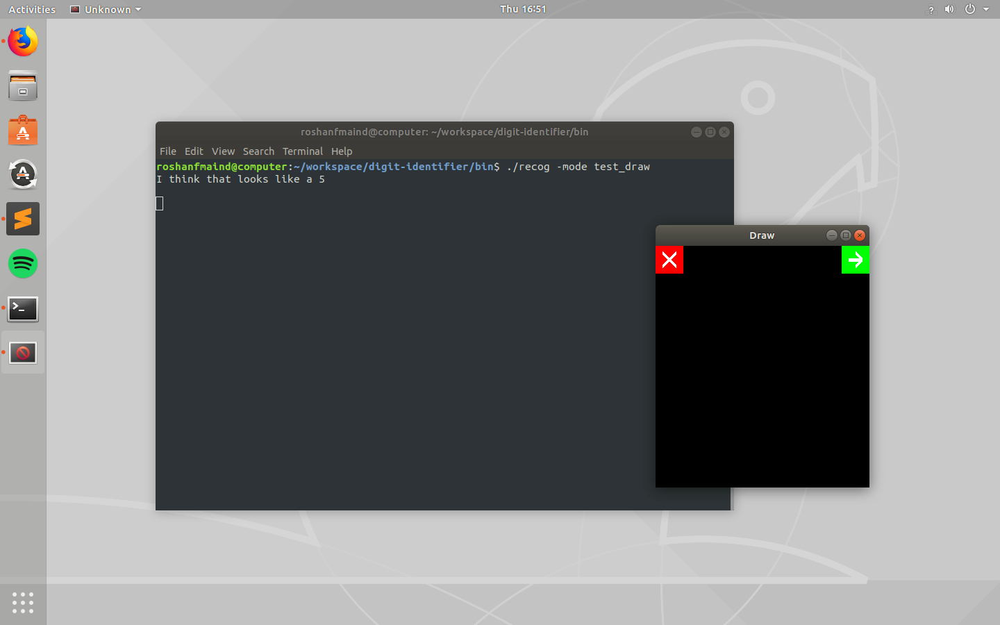
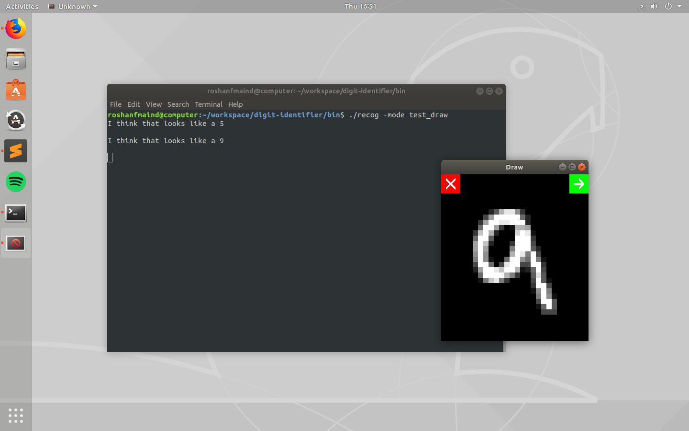

# Digit Recognizer

Handwritten digit recognition ML program written from scratch with CUDA for parallel computations which uses an FNN to predict the digit entered. The FNN.hpp is an 
extremely general implementation. One can move the three files, "FNN.hpp", "cuda.hpp" and "cuda.cu" to their project, include the
"FNN.hpp" and create an FNN object and use it. Just remove the last 3 lines from "FNN.hpp". It is the only bit of code which is
this project specific.

### Features
There are 4 different modes in which the program can run. How to select a mode is given in the "Use" section of this file.

##### 1. The Training Mode. 
The training mode allows user to alter the hyperparameters to any value that they wish. How these options are set is given in the
options_help.txt file present in the /docs folder.



##### 2. The Complete Test Mode
This tests the model on all of the 10k images of MNIST database in about two seconds.


##### 3. The Single Test Mode
This test launches an OpenGL graphics window along with the main program. When the user clicks on the green arrow button on the 
window, a new image from the database is loaded on the window and is passed to the FNN and the FNN's guess is shown on the
terminal window. Pressing the red X button will cause the program to terminate.



##### 4. The Draw Test Mode
This feature of the program is not entirely perfect yet but still it gives quite acceptable results. Using this mode, the user can draw on an OpenGL window which will be launched along with the program. And pass
the current frame state to the FNN by pressing the green arrow button and let the FNN make its best guess. Pressing the red X
button will cause the window frame to get cleared for drawing the next test digit.







### Requirements
	1. Linux OS
	2. OpenGL library*       (mesa-utils and freeglut3-dev)
	3. g++*
	4. Nvidia GPU 	        (sorry ._.)
	5. nvcc*  
	
	 *needed only for building the project again.

If you don't have OpenGL or nvcc you can still use this program using the pre-built binary file provided in the /bin folder.
However, you will still need an Nvidia GPU to run it.

### Build

1. Right click the build.sh file. Click on "Properties". Go to "Permissions" tab and make sure the checkbox reading "Allow
executing file as a program" is checked.

2. Right click the empty_build.sh file. Click on "Properties". Go to "Permissions" tab and make sure the checkbox reading "Allow
executing file as a program" is checked.

3. In the terminal (navigated to the project directory), type 
	```
	./build.sh
	```
        
to build the project. You will find the produced binary in the /bin folder.

4. To empty the /bin folder type in the terminal (navigated to the project directory) 
	```
	./empty_build.sh
	```
	
### Use

Launch a terminal naviagted to the /bin folder in this project. To launch the program, enter
```
./recog [options]
```

Check "options_help.txt" file in the /docs folder of the project for a list of options and their meanings. Or just type 
```
./recog
```
One neural network is provided in the /saved_FNN folder of 2 hidden layers of 200 and 60 neurons each having an accuracy of
95.840004% named "mnist.fnn". It is the default choice of the program so if you don't specify the name of the FNN to be used,
that is the one which will be used.
